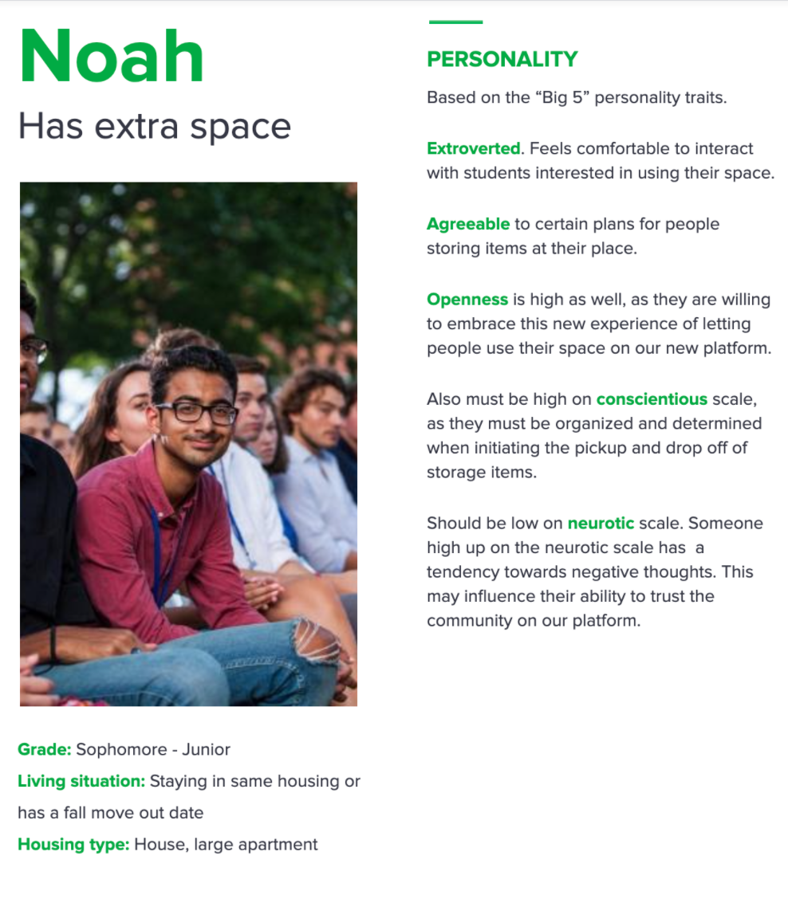
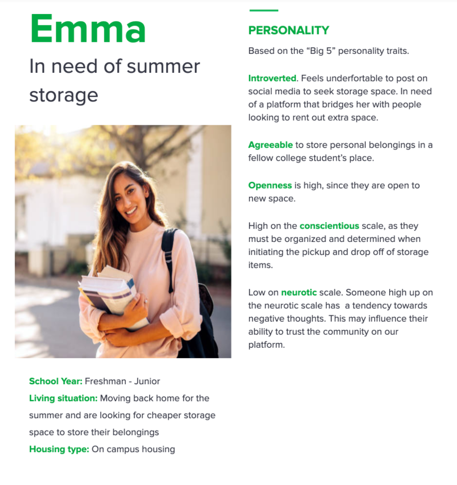
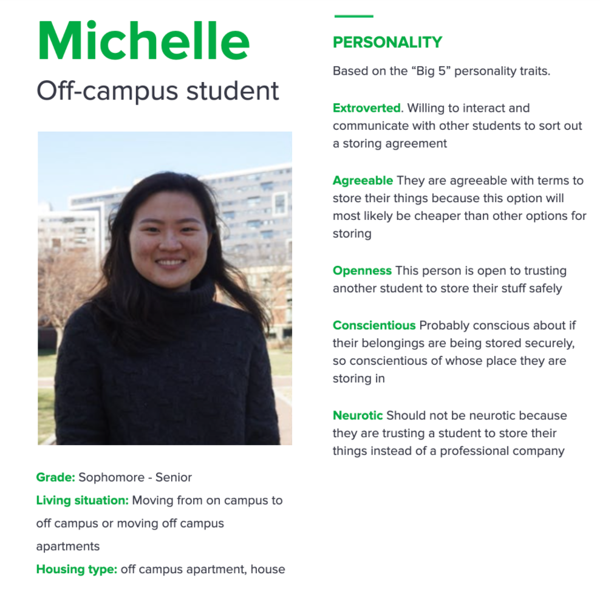
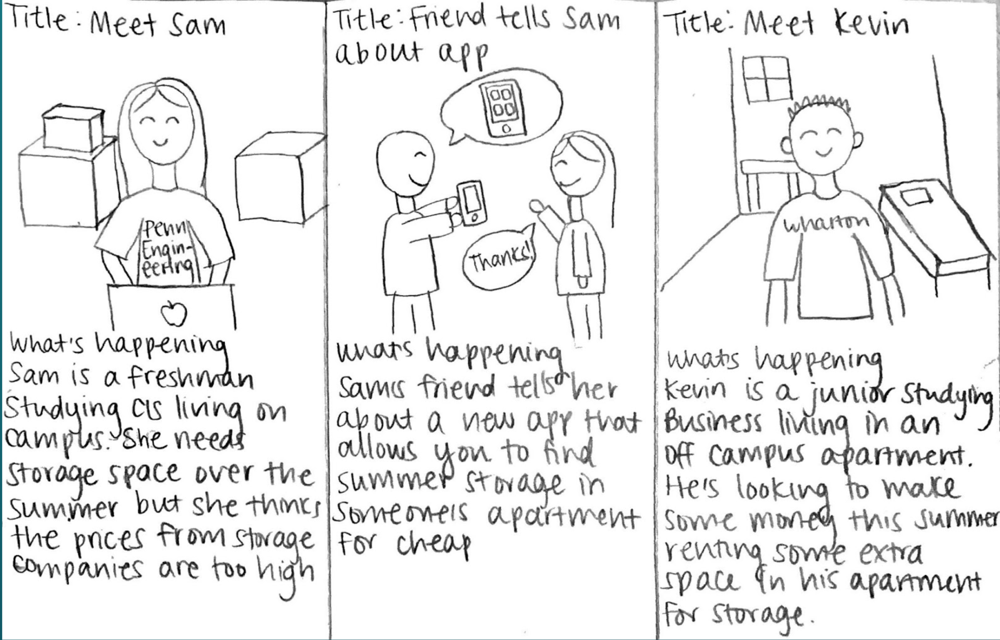
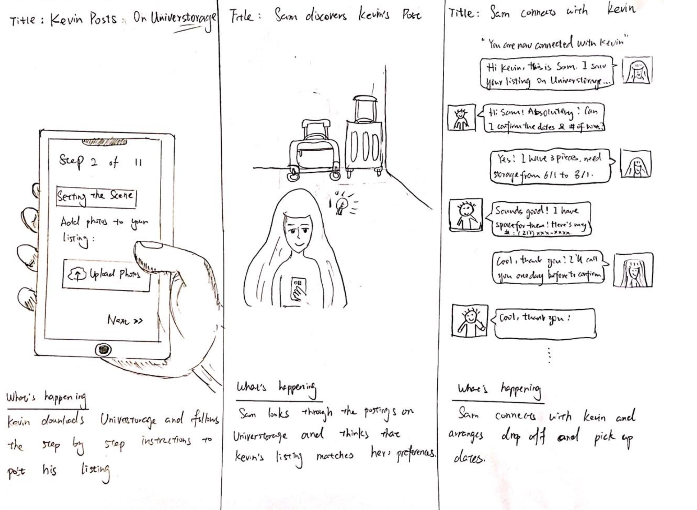
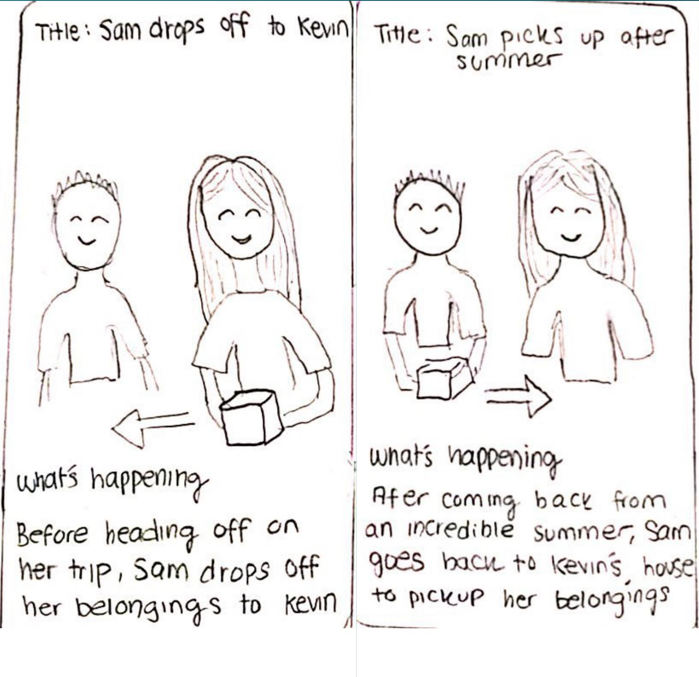

# Problem Statement

Place a short description (3 sentences max) of your problem. 

- Explain the decision inefficiency in the state of problem today.

Because of the constantly changing living situation, college students often find themselves in a summer situation where they have no places to store their belongings. The services offered by the existing storage companies can be very expensive and inefficient, since there could only be a limited number of pickup or drop off dates, and at the same time we thought that many upperclassmen who are going back home or going away for summer internships have extra spaces in their apartments or houses.

- Why is it importnat or worth solving?

This is important because every year we have been at Penn, we have seen people struggle to find summer storage with no tangible solution. We think it is worth solving because it would fix an inefficiency in student summer storage by providing a platform for the supply and demand to meet and optimize their storage needs.

# User Personas

### Persona 1, Noah 

### Persona 2, Emma

### Persona 3, Michelle

# Conversation Starters

1. Where have you lived during your four years at Penn?
2. How did you store your belongings over the summer(s)?
3. How do you feel about the summer storage options available in University City?
4. Would you be willing to pay money to store your items somewhere, and if so how much?
5. Do you have any concerns about how you stored your items over the summers?

# User Interviews

### Interview 1, Sneha Sharma

- The interview was conducted in April. Sneha is a junior in the College studying PPE and lives in off-campus housing. We met up in person at Sneha's off-campus apartment. 
- Sneha lives in an off campus apartment and she has stored her belongings at friend’s homes, at her uncle’s house in Boston, and at Penn’s COVID storage. She feels that it is difficult to store her things and is annoying to have to split her things between different places.

### Interview 2, Matthew Han

- The interview was conducted in April. Matthew is a junior in Wharton studying Business and lives in the Radian. The interview took place over Facetime.
- Matthew has lived in the Quad, the Hub and the Radian and has stored in friends’ apartments and in his fraternity house. He has had trouble in the past storing in his frat basement because there was leakage on his belongings and they got ruined so he wants a more trustworthy space in good condition.
    
### Interview 3, Sylvia Chen

- The interview was conducted in March. Sylvia is a sophmore in Wharton and the college, and she lives on campus. The interview took place over Zoom.
- Sylvia lives on campus, and during her freshman year summer she had stored her belongings with a storage company. She found out that there were many hidden charges throughout the process, and she was highly unsatisfied with the recklessness that the person displayed when he handled her belongings.  
    

# Learnings from the User Interviews

### Learning 1

We should market our product towards freshmen who do not yet have close relationships with upperclassmen who live off campus. Therefore we should focus our marketing efforts near freshman housing like the Quad, the freshman Facebook group and groupme chat, and to different listservs.

### Learning 2 

There are many different preferences that people have for summer storage such as location, transaction method, housing conditions, etc. Therefore we will have a filter feature and a checklist of features available on the postings so that people can find the posting that best fits their needs.

### Learning 3

People are willing to pay different prices for different services and quality of storage space. Therefore, our pricing system allows the poster to determine their own price and we offer a guide of average storage prices in the area so that they can keep their own prices under that standard. In addition, we allow posters to offer transportation assistance for additional money.

# Storyboarding a Solution

## Frame 1, User Situations

- Meet Sam, a freshman studying CIS at Penn living on campus and in need of cheap summer storage.
- Sam’s friend tells her about Universtorage, a new app that allows you find cheap summer storage with another student in University City.
- Meet Kevin, a junior studying Business at Penn living off campus and looking to make a little extra money renting out space in his apartment for storage.

## Frame 2, Kevin and Sam connects through Universtorage

- Kevin downloads Universtorage and follows step by step instructions to make a posting for available storage space in his apartment.
- Sam looks through Universtorge postings and finds Kevin’s listing which matches her preferences.
- Sam connects with Kevin and arranges drop off and pick up logistics with him.

## Frame 3, Dropping off and Picking up

- Before leaving for the summer, Sam drops off her belongings at Kevin’s apartment.
- After a great summer, Sam return to campus in the fall and picks up her belongings from Kevin, and both Kevin and Sam are satisfied with the process.

# Next Steps

- Technical Implementation: Our next step would be to create a prototype of our product. In class we learned that it is better to make an imperfect prototype and release it early to get feedback rather than wait until you have the “finished” product. This includes developing a more detailed monetization model, as well as implementing the specific features of the website through Ruby and JavaScript. 
- More interviews: After creating a rough prototype and having people try it out, we would conduct more interviews to get feedback and continue to improve our product.
- Compare with existing solutions: We would want to see how our app performs in comparison to other storage solutions in University City. Do we need to change our pricing strategy? How can we improve our marketing? In addition, we have the privilege that something that is already successful and is very similar to our product, namely Airbnb, already exists. We want to carefully study the decisions and mistakes that the Airbnb development team had made in the past, and we hope by doing so we will be able to shorten the development horizon of our product.  
